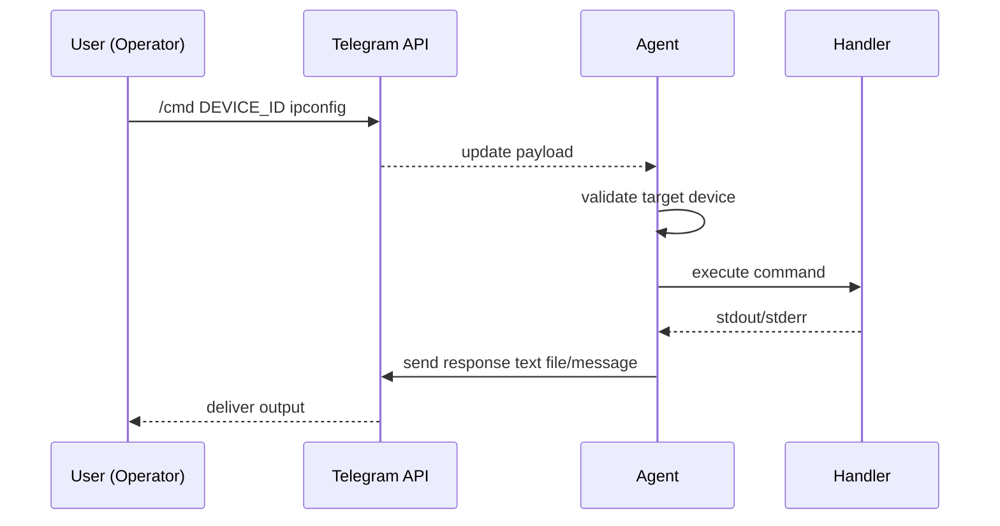
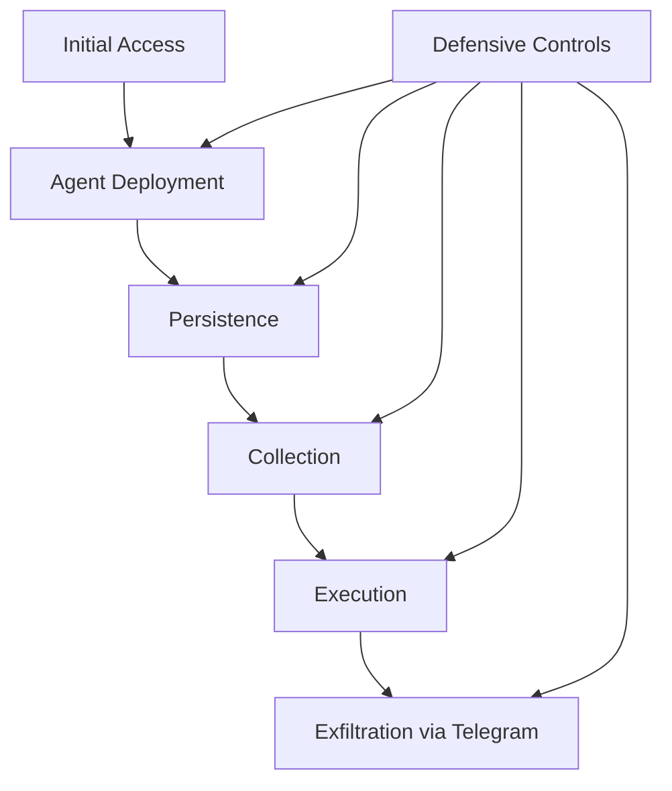

# TELEGRAM-BASED ENDPOINT MONITORING AND REMOTE ADMINISTRATION FRAMEWORK

**A Research Paper prepared in institutional report style (final-year project format)**  

**Student Name:** _[Your Name]_  
**Register No.:** _[Your Register Number]_  
**Department:** _[Department Name]_  
**Institution:** _[Institution Name]_  
**Guide:** _[Guide Name]_  
**Academic Year:** _[YYYY–YYYY]_  

---

## Abstract

This research paper presents the design, implementation, and evaluation of a Telegram-based endpoint monitoring and remote administration framework developed as a final-year cybersecurity project. The proposed system demonstrates how a centralized operator can monitor multiple Windows endpoints through a Telegram bot interface while collecting host telemetry and executing controlled remote actions. The framework includes modules for keystroke capture, clipboard tracking, system profiling, screenshot acquisition, webcam capture, shell command execution, Wi-Fi credential enumeration, and remote file retrieval.

The project is positioned as a controlled security-research platform for understanding command-and-control (C2) workflows and endpoint defense challenges. The architecture employs modular Python components, encrypted storage of bot credentials, startup persistence simulation, single-instance execution controls, and device-specific command routing. Evaluation in a lab setup indicates that text-based command handling provides fast turnaround, while media operations experience predictable latency due to capture and upload overhead. Multi-device management via device IDs is shown to be practical for centralized orchestration.

From a defensive perspective, the project highlights telemetry points that organizations can monitor: suspicious startup entries, keyboard-hook behavior, repeated clipboard access, unusual PowerShell usage, and recurrent Telegram API traffic from unmanaged hosts. The paper emphasizes legal and ethical boundaries and provides mitigation recommendations including application control, endpoint detection rules, and network policy restrictions. This work contributes a practical implementation blueprint and an adversary-emulation reference that helps both students and defenders understand real-world endpoint monitoring trade-offs.

**Keywords:** endpoint monitoring, Telegram bot, remote administration, command-and-control, adversary emulation, defensive security

---

## 1. Introduction

### 1.1 Background

Recent endpoint attacks often avoid custom infrastructure and instead use trusted public services for communication. This strategy reduces operational friction for attackers and complicates detection for defenders because network traffic appears legitimate. Messaging platforms with bot APIs can become lightweight C2 channels capable of carrying both commands and exfiltrated data.

In academic environments, this creates two needs: (i) realistic offensive simulation tooling for controlled cyber labs, and (ii) defensive understanding of host and network indicators generated by such tooling. This project addresses both needs through a Telegram-driven endpoint monitoring framework implemented in Python.

### 1.2 Problem Statement

Many student security projects remain either highly theoretical or narrowly scoped (e.g., keylogger-only, screenshot-only). They rarely demonstrate end-to-end orchestration across multiple endpoints, command routing, and security evaluation in one integrated system. Therefore, a consolidated research prototype is required to:

- emulate realistic endpoint control workflows,
- collect diverse telemetry,
- study reliability and operational trade-offs, and
- extract defensive insights relevant to enterprise monitoring.

### 1.3 Objectives

1. Build a modular endpoint agent for Windows with telemetry and command-execution capabilities.  
2. Integrate Telegram bot APIs for bidirectional communication (commands + responses).  
3. Enable multi-device control using unique device identifiers.  
4. Evaluate command latency, reliability, and practical limitations in a testbed.  
5. Document ethical boundaries and defender-focused detection opportunities.

### 1.4 Scope

The scope includes controlled execution in an authorized lab environment, functional validation of modules, and qualitative operational analysis. The scope excludes unauthorized deployment, live-environment abuse, and production-grade stealth optimization.

---

## 2. Literature Context and Technical Motivation

Existing remote administration approaches range from enterprise endpoint management suites to open-source administration utilities and malicious RAT families. Research consistently shows that attacker workflows rely on common phases: initial execution, persistence, host reconnaissance, command execution, and data exfiltration. Public cloud and messaging services are frequently used to blend outbound traffic with normal user behavior.

Telegram-based bot frameworks are especially attractive for prototypes due to:

- simple HTTP APIs,
- broad platform availability,
- support for file transfer,
- low setup overhead compared to self-hosted C2 infrastructure.

However, these benefits also create defensive challenges. If organizations do not profile expected outbound application behavior, endpoint agents can communicate for long periods with minimal network-level alarms.

---

## 3. Proposed System Architecture

The system follows an operator–platform–agent model. Telegram acts as the transport medium; the endpoint agent implements data collection and command handlers.

### 3.1 Architecture Diagram

> **Institutional submission note:** If your department requires image-only figures, export your existing architecture figure from `final_zeroth_review0.pdf` and replace this Mermaid figure with that image.

```mermaid
flowchart LR
    OP[Operator Console\n(Telegram Chat)] -->|Commands| TG[Telegram Bot API]
    TG -->|Updates Polling| AG[Endpoint Agent]
    AG -->|Text Logs / Media / Files| TG
    TG -->|Response Delivery| OP

    AG --> K[Keystroke Module]
    AG --> C[Clipboard Module]
    AG --> S[System Info Module]
    AG --> M[Screen/Webcam Module]
    AG --> R[Remote Shell Module]
    AG --> W[Wi-Fi Profile Module]
    AG --> F[File Retrieval Module]
```

### 3.2 Module Responsibilities

- **Runtime Core:** startup initialization, credential decryption, mutex validation, thread lifecycle management.  
- **Command Router:** parsing Telegram commands and checking target device ID.  
- **Collection Modules:** keyboard, clipboard, system metadata, screenshot/webcam artifacts.  
- **Execution Modules:** cmd/powershell execution, directory traversal, file transmission, Wi-Fi details extraction.  
- **Persistence Routine:** startup-registration behavior for reboot continuity.

### 3.3 Workflow Sequence



---

## 4. Implementation Details

### 4.1 Technology Stack

The implementation is Python-based, using libraries for keyboard/clipboard hooks, screen capture, webcam handling, network requests, and cryptographic token handling. The architecture is modular so each feature can be enabled or disabled depending on project needs.

### 4.2 Configuration and Credential Handling

Bot token and chat ID are stored in encrypted form and decrypted at runtime. This does not replace enterprise secret management but prevents immediate plain-text extraction in source-level inspection.

### 4.3 Single-Instance Control

A mutex-based check ensures only one active process instance per host. This avoids duplicate event logging and conflicting upload threads.

### 4.4 Device Identification and Multi-Endpoint Routing

Each endpoint has a device ID (defaulting to host identity). Operator commands include this ID so that one chat can orchestrate multiple nodes without ambiguity.

### 4.5 Command Set Summary

| Category | Example Command | Purpose |
|---|---|---|
| Device management | `/devices`, `/rename` | discover and rename active endpoints |
| Host profile | `/sysinfo` | collect system + network context |
| Visual capture | `/screenshot`, `/camerashot` | receive screen/webcam data |
| Filesystem control | `/ls`, `/cd`, `/getfile` | inspect and retrieve files |
| Network credentials | `/wifilist`, `/getwifi` | enumerate stored Wi-Fi profiles |
| Remote execution | `/cmd`, `/powershell` | run shell-level instructions |
| Maintenance | `/uninstall` | self-removal in controlled tests |

---

## 5. Experimental Setup and Evaluation

### 5.1 Lab Setup

- Isolated Windows test endpoint(s)  
- Telegram bot with authorized chat binding  
- Stable internet connectivity for API communication  
- Controlled data set for non-sensitive validation

### 5.2 Evaluation Criteria

1. **Response Latency:** time from command issuance to operator-visible response.  
2. **Execution Success Rate:** ratio of successful command completions.  
3. **Media Transfer Practicality:** reliability for screenshots/webcam captures and larger artifacts.  
4. **Host Footprint:** CPU and memory behavior during idle and active intervals.

### 5.3 Observations

- Textual operations (`/sysinfo`, `/ls`, `/cmd`) generally respond quickly under normal bandwidth.  
- Media operations show higher but acceptable delay due to capture and upload stages.  
- Device-based routing allows clean control of multiple endpoints from one Telegram interface.  
- Long-duration recording/capture increases process visibility and resource utilization.

### 5.4 Limitations Noted During Testing

- API dependence means network outage directly impacts command responsiveness.  
- Webcam operations may fail because of hardware permissions or device absence.  
- Platform upload constraints affect very large file transfers.

---

## 6. Security Analysis and Defensive Insights

### 6.1 Threat Mapping View

The framework reproduces several ATT&CK-relevant behaviors (persistence, command execution, collection, and exfiltration). This makes it useful for detection-engineering exercises.

### 6.2 Risk Lifecycle Diagram



### 6.3 Detection Opportunities for Blue Teams

- Alert on unauthorized startup-folder or registry autorun changes.  
- Detect repeated keyboard-hook and clipboard-access behaviors.  
- Monitor anomalous shell invocation patterns from Python processes.  
- Restrict or inspect Telegram API traffic from unmanaged endpoints.  
- Block known credential-dumping command patterns via endpoint policy.

### 6.4 Mitigation Recommendations

1. Deploy application allowlisting for scripting engines and unknown binaries.  
2. Enforce least privilege and disable unnecessary local admin rights.  
3. Apply EDR behavior rules for suspicious parent-child process trees.  
4. Implement egress filtering and sanctioned-messaging policies.  
5. Run periodic incident simulations using this framework in controlled labs.

---

## 7. Ethical, Legal, and Institutional Compliance

This work must only be used for academic experimentation in authorized environments. Unauthorized monitoring is illegal and violates institutional ethics policies. The following controls are mandatory:

- written consent before deployment,
- isolated lab usage only,
- no real personal data collection,
- faculty oversight and auditable logs,
- secure disposal of collected artifacts after evaluation.

---

## 8. Conclusion and Future Work

This project demonstrates a complete Telegram-integrated endpoint monitoring framework suitable for cybersecurity education, adversary emulation, and defensive analysis. The system’s modular architecture, command richness, and multi-device support provide realistic operational behavior while remaining manageable for student-level implementation.

Future work should focus on stronger key management, transport abstraction beyond Telegram, cross-platform support, safer opt-in execution models, and structured analytics dashboards for defenders.

---

## References (Institutional/IEEE style placeholders)

[1] MITRE ATT&CK®, “Enterprise Matrix,” MITRE Corporation.  
[2] Telegram, “Bot API Documentation,” official developer documentation.  
[3] NIST SP 800-53, *Security and Privacy Controls for Information Systems and Organizations*.  
[4] Microsoft, “Windows Security Baselines,” Microsoft Security Documentation.  
[5] OWASP, “Logging Cheat Sheet,” OWASP Foundation.

---

## Appendix A: Figure Placement Guide (for your institutional template)

- **Figure 1:** System Architecture (Section 3.1)  
- **Figure 2:** Command Workflow Sequence (Section 3.3)  
- **Figure 3:** Risk Lifecycle and Defensive Interception (Section 6.2)

If your `final_zeroth_review0.pdf` already contains approved institutional diagrams, keep the same figure numbers/captions and replace the Mermaid blocks with those exact images when exporting the final DOC/PDF.
